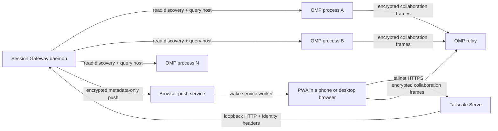

<div align="center">

<picture>
  <source media="(prefers-color-scheme: dark)" srcset="assets/logo.svg">
  <source media="(prefers-color-scheme: light)" srcset="assets/logo-light.svg">
  
</picture>

# OMP Session Gateway

**Every live OMP session. One private page, in any modern browser.**

**Native integration with stock OMP `18.1.20+`. No fork or custom OMP build.**

Keep using [Oh My Pi](https://github.com/can1357/oh-my-pi) in your terminal.
OMP Session Gateway discovers your collaboration-enabled sessions, shows which need attention,
and opens OMP's own encrypted **View** or **Control** client from your phone or any other browser —
no QR scans, copied links, or per-session setup.


<sub>Synthetic product demo—not release-qualification evidence. <a href="docs/media/README.md">Capture provenance</a>.</sub>

**[Website](https://alphastorm.github.io/omp-session-gateway/)** · **[Build and run](#build-and-run)** ·
**[How it works](#how-it-works)** · **[Security model](docs/SECURITY.md)** ·
**[Compatibility](docs/COMPATIBILITY.md)** ·
**[Latest stable release](https://github.com/alphastorm/omp-session-gateway/releases/latest)**

[![CI][ci-badge]][ci]
[![Coverage][coverage-badge]][coverage]
[![Releases][release-badge]][releases]
[![OMP baseline][omp-badge]][omp-lock]
[![License][license-badge]][license]

[ci]: https://github.com/alphastorm/omp-session-gateway/actions/workflows/ci.yml
[ci-badge]: https://img.shields.io/github/actions/workflow/status/alphastorm/omp-session-gateway/ci.yml?branch=main&label=CI&labelColor=0B0E11
[coverage]: https://codecov.io/gh/alphastorm/omp-session-gateway
[coverage-badge]: https://img.shields.io/codecov/c/github/alphastorm/omp-session-gateway?label=coverage&color=1C232B&labelColor=0B0E11
[releases]: https://github.com/alphastorm/omp-session-gateway/releases
[release-badge]: https://img.shields.io/github/v/release/alphastorm/omp-session-gateway?include_prereleases&filter=v*&label=release&color=C99B45&labelColor=0B0E11

[omp-lock]: UPSTREAM.lock.json
[omp-badge]: https://img.shields.io/badge/dynamic/json?url=https%3A%2F%2Fraw.githubusercontent.com%2Falphastorm%2Fomp-session-gateway%2Fmain%2FUPSTREAM.lock.json&query=%24.tag&label=OMP%20baseline&color=1C232B&labelColor=0B0E11
[license]: LICENSE
[license-badge]: https://img.shields.io/github/license/alphastorm/omp-session-gateway?color=1C232B&labelColor=0B0E11

<sub><strong>Private by design:</strong> loopback-only gateway · allowlisted tailnet identity · memory-only capabilities · no transcript storage</sub>

</div>

## Private flosrn fleet fork

This fork adds a managed fleet directory at `https://omp.shipmate.bot`, behind Cloudflare
Access, for the Mac and HarnessOS compute hosts. Tap **Control** to open the same-origin pinned
OMP client. Stale and empty hosts remain visible; unavailable sessions cannot launch.
The upstream release links and qualification tables below describe upstream artifacts, not this
fork's Access/federation deployment. Stock OMP remains unchanged.

Reload and foreground recovery remember only `{version, instanceId, generation, mode}` in
`localStorage` (`omp.sessions.active.v1`). A fresh authenticated snapshot must match the exact
generation and role before a new capability is requested; a changed or missing session stays in
the directory. **Back** clears the selection. No capability, link, title, path or transcript is
stored for resume, and this does not keep a suspended phone browser running.

Access mode is an explicit alternative authenticator in this fork, not permission to put a
tunnel in front of `tailscale-serve`. That mode retains its existing fail-closed Serve boundary.
See [fork configuration](docs/OPERATIONS.md#private-flosrn-fleet-deployment),
[security limits](docs/SECURITY.md#private-flosrn-access-and-fleet-boundary), and
[evidence scope](docs/COMPATIBILITY.md#private-flosrn-fork-evidence).


> **Works with upstream OMP, not a gateway-specific build.** OMP's native collaboration registry
> shipped in [v18.1.20](https://github.com/can1357/oh-my-pi/releases/tag/v18.1.20)
> ([PR #11908](https://github.com/can1357/oh-my-pi/pull/11908)). Enable `collab.autoStart` once,
> install the gateway, and configure Tailscale Serve. Then start sessions with plain `omp`.
> **[Get started with the latest stable release](#build-and-run)** ·
> [Exact support and limits](docs/COMPATIBILITY.md) · [Release evidence](docs/RELEASE_STATUS.md).

## Works with

Use OMP Session Gateway from modern browsers. Install it as a PWA on platforms that support
installation.

| Gateway host | Status |
|---|---|
| Linux | ✅ |
| macOS | ✅ |
| Windows | ✅ |

| Browser | Status |
|---|---|
| Chrome / Chromium | ✅ |
| Edge | ✅ via Chromium |
| Firefox | ✅ |
| Safari / WebKit | ✅ |
| Android | ✅ |
| iPhone / iPad | ✅ as a browser |

✅ means supported: CI tests it on every change. Each release is also qualified on real hardware
for exact combinations. Those, and every limit, are in
[Compatibility](docs/COMPATIBILITY.md#platforms-and-browsers).

[TestingBot](https://testingbot.com) supports this project with free real-device testing through its
open-source program.

OMP Session Gateway is a local-first companion for Oh My Pi (OMP). The terminal remains the source
of truth: the gateway is a private directory for already-running interactive OMP processes, a
metadata-only attention queue, and a just-in-time **View**/**Control** capability broker — not a
second agent client. Opening a session hands off to OMP's existing encrypted `collab-web`
interface; the gateway never stores or renders transcripts.

This is a community project and is not affiliated with or endorsed by the Oh My Pi maintainers.

## Build and run

Start with the [latest stable release](https://github.com/alphastorm/omp-session-gateway/releases/latest),
**Bun 1.4.0**, and stock **OMP 18.1.20 or later**. Read the
[exact supported combinations and limits](docs/COMPATIBILITY.md) before installing.
The gateway and phone need Tailscale on the same tailnet; the gateway host must use the TUN-mode
client with Serve over HTTPS. **Never enable Funnel.**

### 1. Enable collaboration once in OMP

```sh
omp --version # must report at least 18.1.20
omp config set collab.autoStart control # or view for read-only sharing
```

Then start participating sessions with plain `omp`. Existing processes do not rerun startup when
this setting changes; start new sessions after enabling it. No OMP fork, gateway-specific plugin,
custom build, or publisher credential is required.

### 2. Install the gateway

Download and [verify the published archive](docs/RELEASE.md#verify-a-published-build), then extract
`omp-session-gateway-<version>-bun.tar` and enter `omp-session-gateway-<version>-bun/`.
The release contains a Bun JavaScript entry point, not standalone native binaries.

**Upgrading from v0.3.0 or earlier?** Retain its signed archive and private configuration, then
use that archive's `uninstall` command to stop and unregister the old gateway first. Follow
[the stopped upgrade procedure](docs/UPGRADE_ROLLBACK.md); do not import a credential bundle.
Gateway rollback does not switch the OMP executable.

From the verified release directory:

```sh
bun apps/gateway/src/cli.js install \
  --origin https://host.tailnet.ts.net \
  --allow user@example.com
bun apps/gateway/src/cli.js serve-guidance
```

On Windows, run these in PowerShell with each command on one line; PowerShell does not continue a
line with `\`. [Operations](docs/OPERATIONS.md#2-cli-and-daemon-installation) has the exact
PowerShell steps, including extraction with the `tar` that Windows 10 and later include, and
[verification](docs/RELEASE.md#verify-a-published-build) includes a PowerShell checksum check.

Use your host's tailnet HTTPS origin and exact Tailscale login. **Run the Tailscale Serve command
printed by `serve-guidance`**, then check the deployment:

```sh
bun apps/gateway/src/cli.js doctor
```

### 3. Open OMP Sessions on your phone

Open the configured HTTPS address from your allowlisted, user-authenticated Tailscale device and
add **OMP Sessions** to the home screen. New collaboration-enabled sessions appear on the next
discovery poll (10 seconds by default). Tap **View** or **Control**; OMP stays in your terminal.

Setup is one-time, not per-session. See [operations](docs/OPERATIONS.md) for discovery overrides,
service management, and diagnostics. If `doctor` reports `loopbackTrustSound: false`, fix the
host's TUN-mode Tailscale setup; do not bypass the identity check.

<details>
<summary>Build from source for development</summary>

Use Bun 1.4.0 in this checkout. A source build does not inherit the signed release's qualification.

```sh
bun install --frozen-lockfile
bun run check

# Loopback-only development mode
bun apps/gateway/src/cli.ts serve \
  --dev-localhost \
  --port 4317 \
  --origin http://127.0.0.1:4317
```

For a source-based production install, run `bun run build`, then use the installation commands
above with `apps/gateway/src/cli.ts` instead of the archive's `.js` entry point.
`bun run release:build` builds the deterministic Bun-runtime archive and checksum manifest;
it does not qualify or publish that build.

</details>

## How it works

<div align="center">

</div>

<table>
  <tr>
    <td align="center" width="33%">
      <br>
      <strong>Every session, automatically</strong><br>
      <sub>No per-session command, QR scan, or link copy.</sub>
    </td>
    <td align="center" width="33%">
      <br>
      <strong>The oldest ask first</strong><br>
      <sub>Bounded metadata outside; the authoritative prompt stays in OMP.</sub>
    </td>
    <td align="center" width="33%">
      <br>
      <strong>One tap to the real session</strong><br>
      <sub>View or Control opens OMP's existing encrypted client.</sub>
    </td>
  </tr>
</table>

<sub>All media on this page is captured from the built app and pinned collaboration client, driven
by seeded synthetic fixture data — no real sessions, hosts, accounts, or capabilities. The media
reflects its recorded capture baseline, not qualification of the current OMP pin. Regeneration
steps: [`docs/media/README.md`](docs/media/README.md) · MP4 master:
[`omp-session-gateway-demo.mp4`](docs/media/omp-session-gateway-demo.mp4).</sub>

## The problem

OMP’s collaboration feature already provides an excellent browser experience. Mainline OMP now
starts collaboration and publishes its live hosts automatically when configured; manually opening each link or QR code on a phone still
does not scale across several terminals. The gateway removes that per-session
ceremony without widening exposure: it lists every live OMP session automatically, surfaces a
metadata-only **Needs you** state when one is waiting for human input, opens read-only or
full-control collaboration in one tap, removes stale sessions on its own, and keeps collaboration
capabilities out of the public Internet, logs, notifications, and persistent browser storage.

## User experience

After installation and tailnet configuration:

1. `omp-gatewayd` starts automatically when the desktop user logs in; `omp-gateway serve` provides
   the equivalent foreground/development entry point.
2. Tailscale Serve exposes only the loopback dashboard/API to approved tailnet identities.
3. Each interactive `omp` process automatically starts collaboration when configured. The gateway
   reads OMP’s discovery directory and polls metadata; it fetches a capability only when you launch.
4. The PWA lists collaboration-enabled processes on the next discovery poll: a FIFO **Needs you** queue when
   anything is waiting, otherwise **All clear** and the live sessions.
5. **Open request** launches Control for the oldest ask; **Hold for desk** defers that exact ask on
   this device and advances to the next one without clearing attention; **Transcript** stays
   read-only. **Hide** can remove a non-attention row on this device with Undo and Show all,
   but OMP keeps running. The healthy gateway shell stays quiet, distinguishes gateway and relay
   interruptions when they persist, and keeps each answer at `Sending…` until OMP acknowledges
   it. After an authoritative answer, it offers the next ask or returns to the exact directory
   order and scroll position.
6. **Background alerts, qualified on the Pixel only:** the Settings sheet behind the masthead
   control can enable background Web Push alerts and choose Private, Session, or Preview detail.
   The no-store tap path is capability-free; the qualified Pixel scope and its observed force-stop
   and Doze variants are listed under [Compatibility and release status](#compatibility-and-release-status).
   Since v0.5.0, the activity extension also alerts on observed working-to-idle
   transitions from hosts publishing `busy`; stop taps open View after fresh generation validation.
   Unknown activity, disappearance, and reconnect are never treated as completed work.
7. Session switches, exits, crashes, daemon restarts, and ordinary foreground/online transport
   replacement reconcile without a prominent Refresh control. Abrupt Android radio transitions do
   not reliably self-heal and may require force-stopping Chrome.

<div align="center">
<br>
<sub>Notification detail is chosen per device; payloads are built at the chosen level — the phone
never redacts.</sub>
</div>

## Compatibility and release status

The [latest stable release](https://github.com/alphastorm/omp-session-gateway/releases/latest) was
promoted from a qualified signed candidate with identical runtime bytes. Support covers the
platform families in [Works with](#works-with), each tested in CI; qualification is limited to the
exact hardware combinations in the [compatibility policy](docs/COMPATIBILITY.md#current-claim). The
minimum OMP version does not qualify every host, browser, or future OMP release.

| | Current contract |
|---|---|
| OMP prerequisite | Stock mainline `>= 18.1.20`; earlier releases lack the local registry |
| Exact qualified OMP | `v18.4.2`, commit `4620bb8338e0ecace7ea237da9d5088d16068617`; Bun `1.4.0` |
| OMP settings | `collab.autoStart` only: `off`, `view`, or `control` |
| Remote path | Tailscale Serve over tailnet HTTPS, TUN-mode client, Funnel disabled |
| Supported platforms | Linux, macOS, and Windows hosts; Chromium-based browsers including Edge, Firefox, Safari/WebKit, and Android; iPhone and iPad as a WebKit browser. Each is tested in CI ([matrix](docs/COMPATIBILITY.md#platforms-and-browsers)) |
| Qualified on hardware | Debian 13 x86-64, macOS arm64, and Windows Server 2025 x86-64 (started at interactive logon; from v0.6.3 also installed and run from a standard, non-elevated account) hosts with a Pixel/Android/Chrome client, including background Web Push; from v0.6.2 also Safari on real cloud iPhones and iPads and Chrome on a cloud Galaxy phone, with iPhone alerts proven unlocked with the app in the background, not on the lock screen; each release's exact builds, checks, relay window, and rollback predecessor are in the [compatibility policy](docs/COMPATIBILITY.md#current-claim) and the [release ledger](docs/RELEASE_STATUS.md) |

Exact source and package metadata: [`UPSTREAM.lock.json`](UPSTREAM.lock.json). The upstream merge
[PR #11908](https://github.com/can1357/oh-my-pi/pull/11908) (`4999b98bd5`) makes stock OMP
sufficient starting with [v18.1.20](https://github.com/can1357/oh-my-pi/releases/tag/v18.1.20).

The signed-candidate provenance, exact device measurements, and runtime-byte comparison are
recorded in the [release ledger](docs/RELEASE_STATUS.md). Gateway rollback does not switch the
OMP executable or restore fork-era configuration. See [upgrade and rollback](docs/UPGRADE_ROLLBACK.md).

Known limits are part of the claim — read them before installing:

- **TUN mode is mandatory.** With userspace-networking `tailscaled` there is no tunnel device,
  every tailnet peer arrives as a loopback peer, and the gateway fails closed rather than believing
  an identity header ([#98](https://github.com/alphastorm/omp-session-gateway/issues/98)). See
  [Build and run](#build-and-run) for the `doctor` signal.
- **Never enable Tailscale Funnel.** There is no supported public-Internet path.
- **Android radio transitions have a browser-process limitation.** Chrome for Android can wedge its
  process-wide network stack after a radio change while Android remains healthy. The PWA retries
  and, after 45 seconds of uninterrupted visible failure, opens force-stop/reopen help already
  loaded in the PWA shell; it does not
  claim page JavaScript can repair Chrome ([#65](https://github.com/alphastorm/omp-session-gateway/issues/65)).
- **In v0.5.0 and earlier, a gateway update can close a session you are opening or viewing.** On
  the first visit after an upgrade, the new service worker's activation can navigate a pending
  launch or an open View/Control page back to the directory; open the session again. Chromium
  reports each page's creation URL, so the worker cannot see that a page is in use. The first
  post-release View/Control smoke failures recorded in the release ledger match this navigation.
  The v0.5.1 fix never navigates from the worker; see
  [the current update behavior](docs/ARCHITECTURE.md).
- **The fresh relay gate is 30 minutes, not eight hours.** Eight-hour endurance was not rerun
  and is not claimed; residual prolonged-operation risk is accepted. No bounded-memory-growth
  claim follows from this check.
- **Specialized attention, branch/resume, and new media qualification are not claimed.** The
  current physical checks qualify the core directory/View/Control path, not these separate lanes.
- **Background Web Push is qualified on the Pixel only.** Closed-app delivery at each detail
  level, lock-screen presentation, taps to current Control and View, stale-generation refusal,
  authoritative clear, permission revocation, and network changes pass on the qualified Pixel.
  Force-stop and forced Doze outcomes are recorded as observed variants, never as guaranteed
  delivery. On iPhone and iPad, background alerts need OMP Sessions added to the Home Screen;
  v0.6.0 and earlier cannot enable them there (#274); the fix ships in v0.6.1.
- **Preview notification detail currently falls back to Session detail** — the OMP snapshot
  carries no bounded preview field.
- **Windows is qualified as Windows Server 2025 x86-64, started at interactive logon.** The gateway
  starts at logon, not at boot. From v0.6.3 that includes a fresh install run from a standard
  (non-elevated) account; v0.6.2 and earlier need an elevated install (#293, #294). Other Windows
  versions are supported and tested in CI on every change, with a daily stock-OMP canary, but not
  qualified.
- **Untrusted local accounts are out of scope.** V1 assumes a user-controlled workstation: a direct
  loopback caller can forge non-cryptographic Tailscale identity headers. Do not deploy on a shared
  shell host.
- **Portal Tunnel and self-hosted or proxied relay modes are unsupported.** The gateway supports only
  Tailscale Serve and keeps OMP's existing end-to-end-encrypted relay.

The [compatibility matrix](docs/COMPATIBILITY.md) defines the supported boundary; the
[release ledger](docs/RELEASE_STATUS.md) holds the exact per-candidate evidence and is
authoritative where they disagree.

### Fork-era published-release history

Published `v0.3.0` and signed candidate `v0.3.0-prealpha.3` retain their exact patched OMP
v18.1.14 evidence: Debian 13 x86-64, macOS 26.6.1 arm64, Pixel/Android, relay endurance, and
runtime equivalence. Published `v0.2.1` retains its fork-era patched OMP v17.4.1 baseline. These
archives require their matching source and instructions; no result transfers to mainline.

Fork-era Windows source acceptance on a persistent Server 2025 VM passed install,
reboot→interactive-login startup, `doctor` 17/17, rotation, upgrade/rollback, patched OMP
publication, and uninstall. This is historical evidence only, not Windows OMP qualification.

## Architecture



The recommended v1 keeps OMP's existing end-to-end-encrypted relay and uses the gateway only for
private discovery and just-in-time capability delivery. Self-hosted or proxied relays remain unsupported; they require separate threat modeling and
qualification. Deeper detail: [architecture](docs/ARCHITECTURE.md) ·
[protocol](docs/PROTOCOL.md) · [operations](docs/OPERATIONS.md).

## Why PWA first

OMP already ships `packages/collab-web`, which renders the transcript, streaming output, tool
cards, prompts, interrupts, and subagent controls. A native Android client would duplicate the most
security-sensitive and compatibility-sensitive parts of OMP.

The v1 path is therefore:

- mobile-first PWA for the session directory;
- existing OMP `collab-web` for the actual session;
- optional Trusted Web Activity packaging later; and
- no independent native implementation of OMP's collaboration protocol.

## Security model

OMP collaboration links are bearer capabilities. The implementation treats both view and control
links as secrets.

Release-blocking invariants include:

- capabilities are fetched from OMP per launch and never stored by the gateway;
- list and SSE APIs return metadata only;
- launch capabilities are fetched only after an explicit tap and use `Cache-Control: no-store`;
- no capability enters logs, telemetry, crash reports, files, cookies, Local Storage, IndexedDB, Cache Storage, query strings, or service-worker caches;
- the HTTP server binds only to loopback by default;
- identity headers are believed only while Tailscale's tunnel device is present, because a
  userspace-networking `tailscaled` forwards inbound tailnet traffic to that loopback listener and
  the caller then arrives indistinguishable from a local one;
- production requests require a verified and allowlisted Tailscale identity;
- discovery and per-host queries use OMP’s private files, endpoints, and per-host tokens;
- stale and replaced generations become unlaunchable promptly; and
- the default deployment never enables Tailscale Funnel.

See [the threat model](docs/SECURITY.md) and [security reporting policy](SECURITY.md).

## How it compares

Choose by workflow, not a feature checklist:

- **Keep work in running OMP terminals:** OMP Session Gateway discovers participating sessions
  and opens OMP's existing encrypted View/Control client from one private mobile page. Stock
  **OMP ≥18.1.20** supplies the native registry and controller — no fork, custom OMP build, or
  gateway-specific OMP plugin.
- **Move work into a browser-hosted OMP workspace:** [omp-deck](https://github.com/bjb2/omp-deck)
  embeds the OMP SDK and shares its session/auth store, with persistent browser sessions and
  workflow tools such as kanban, routines, and an inbox.
- **Choose agent web chat, sharing, or remote terminal access:**
  [oh-my-portal](https://github.com/gosuda/oh-my-portal) provides skills over Portal tunnels.
  It supports OMP through RPC and an optional `omp-collab` session-sharing skill.
- **Use a browser/mobile workspace for other coding CLIs:**
  [CloudCLI (claudecodeui)](https://github.com/siteboon/claudecodeui) advertises Claude Code,
  Cursor CLI, and Codex in its README; that README does not advertise OMP support.
- **Use the pi ecosystem:** [pi-agent-dashboard](https://github.com/BlackBeltTechnology/pi-agent-dashboard)
  mirrors pi sessions through a bridge extension. Its README explicitly excludes Oh My Pi.

The gateway still needs one-time setup: a separate install with Bun 1.4.0,
`collab.autoStart`, and TUN-mode Tailscale Serve with an exact allowlist and Funnel disabled.
Then use plain `omp`; no per-session link copying. The minimum OMP version is an integration
contract, not qualification of every later version. See [exact support and limits](docs/COMPATIBILITY.md).

Primary READMEs and package metadata checked **2026-09-14**; this is not a hands-on interoperability
or security assessment. The [source-linked comparison](https://alphastorm.github.io/omp-session-gateway/compare/)
and [upstream discussion](https://github.com/can1357/oh-my-pi/discussions/6460) provide context.

## Repository layout

| Path | Purpose |
|---|---|
| `apps/gateway` | Loopback daemon, OMP discovery/query reader, launch broker, HTTP API, CLI, services, and diagnostics |
| `apps/web` | Mobile session directory PWA and no-secret service worker |
| `packages/protocol` | Runtime-validated OMP discovery/query and browser contracts |
| `packages/collab-client` | Pinned OMP `collab-web` source and in-memory bootstrap patch |
| `scripts/build-web.ts` | Reproducible hashed PWA/client asset build |
| `scripts/build-release.ts` | Deterministic Bun-runtime release archive and SHA-256 manifest |
| `scripts/post-release-smoke.ts` | Published-byte local Mac/physical-Android smoke with owned-fixture cleanup |
| `docs/media` | Canonical README media plus its seeded-fixture capture provenance |
| `docs/` | Architecture, protocol, security, operations, compatibility, and release evidence |
| `UPSTREAM.lock.json` | Exact OMP source and package baseline |


## Contributing and releases

The project is intended to be developed in public. See:

- [Contributing](CONTRIBUTING.md)
- [Backlog](docs/BACKLOG.md)
- [Release status](docs/RELEASE_STATUS.md)
- [Security policy](SECURITY.md)

The project has no telemetry, analytics, or hosted control plane.

Useful, but not installing today? Star the repo so you can find it again.

## License

MIT. See [LICENSE](LICENSE).
